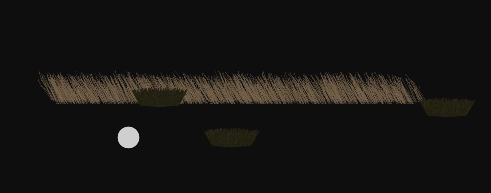
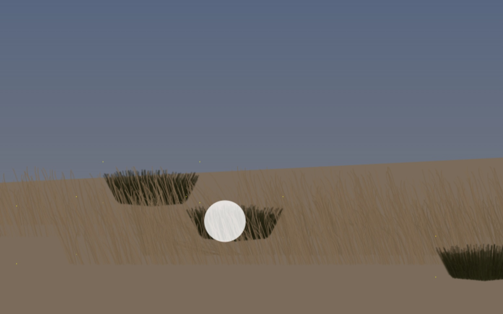
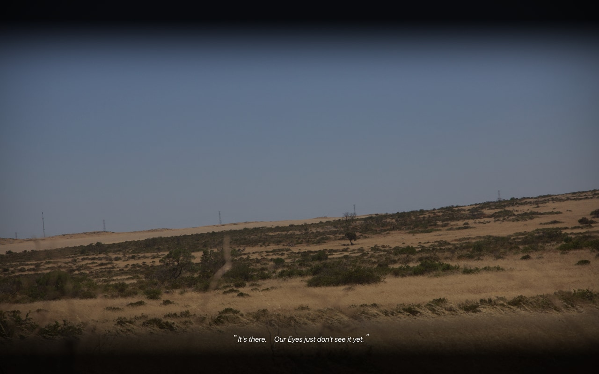

# Fields

Spinifex drawing experiments.

To evolve into my own superior web-based game like Shadow of the Colossus or Bloodborne.

## Sample Images

West Australia Countryside from my road-trip (-10 points anonymity but a bit too late). You can find location with satellite vision.
Conventional letter-boxing looks nice because it's got those crisp edges, but I'm going for something a bit more vignette.

---

## Notes for "Ash Feathers" game

### Characters
#### Ash
- Small character, mostly black (close to key)
- Round features
- Wears a hat, and a cloak that conceals body (animation skills…)
- Skills
	- Call crow when in open space to be picked up

#### Crow
- A crow (but to be just a ball at first)
- Ash rides on top
- Player-controlled
	- The player can control the crow while Ash is riding the crow…
	- However, the crow is a living creature and so it’s consciously flying itself
		- If the player tries to crash the crow, the crow will not crash itself
			- So if you dive to the ground, it will swoop up before crashing
		- If the crow gets upset it may drop Ash
- Super-crow mode
	- When something exciting happens, some of the crow’s black feathers will blend into Parrot or Peacock feathers

#### NPCs
- Spirits
	- White semi-transparent
	- Round features, shaped almost like a single quotation mark
	- Non-threatening
- Seagulls

#### Enemies (Predators)
The theme issa monsters based on countrys crests and the symbolism.
- At first there won’t be any enemies or gameplay
- Giant Eagle
	- Preceded by giant wing shadows
- Giant Lion
- Giant Pig

### Environments
- Large fairly dry grassy and grassless environments
- Seasides and cliffs
- Giant sandhills

### Checklist
- [ ] Draw ghost
	- [x] Head
	- [ ] Face
	- [x] Body
	- [ ] Feet
		- [ ] [Use intersects](https://developer.mozilla.org/en-US/docs/Web/API/CanvasRenderingContext2D/globalCompositeOperation)
- [ ] Create frame-saving system
	- [ ] Draw to offscreen canvas?
	- [x] Draw to separate canvas
	- [x] Draw other canvas to main canvas
	- [ ] Fix issue where first frame is so different it “flashes”

#### Detail
- Quasi-3D Graphics
	- Store object with 360 arrays; each of the arrays being a degree
	- When animating on an angle save the frames into an array on object
	- When still on the same angle 
- Spinifex
	- Detail
		- Detail when close but just a solid colour when distant
			- So as appropriate for level of detail individual blades not necessary for distant spinifex
			- Distanct items blurred or shrunk?
			- Can be “stamped” for the in-betweens
				- Pixel occlusion?
		- Textures like seeds or leaves or foreground blades
		- Colour, usually lighter near top tip, but sometimes middle
		- Not all blades need to be curved, some can just be lines
	- Dimensions
		- 2d easy,
		- 3d? just 2d pointing in direction if thin enough?
			- 3d transform, relative to camera?
		- Variable heights, so tips appear over other objects in scene, like bushes (picture taller yellow grass stems poking out over darker-greener bushes in background, usually bottom or middle depending on height of background object)
	- Moves
		- Depending on force
			- Subtle normal force, and gusts increase force
			- Physical contact produces a constant force
			- Wind currents create snake-like force through rows of blades
				- picture a column in a spreadsheet if it wasn’t perfectly aligned
			- Majority may not be affected by wind as much
				- & may not need to update in as many of the frames ;)
	- Instancing pattern?
		- So calculate one blade and have randomly distribute dupes
		- Most will face the same way, but there will be a bunch facing opposite etc, that creates a natural “hatching” effect
		- Immediately adjacent blades can have similar angle,
			- so can distribute slight variance in a row in clumps
				- with contrasting blades of different angles interspersed
		- Blade heights vary but often still have a consistent “wave” shape across tips
	- Frames
		- Persist base positions across frames
			- Bottom of grass blades never moves
		- Broad distribution initially
		- Each frame can only move small amount from prior position
	- Existing examples
		- [Shadow of the Colossus](https://youtu.be/zAo9OqEmSRM?t=13096)

### Sequence
#### Intro
- Looking up at cloudless sky, see tips of large crow wings
- Cut to grassland, where large shadow appears, whoosh, and down hero plops
- 

